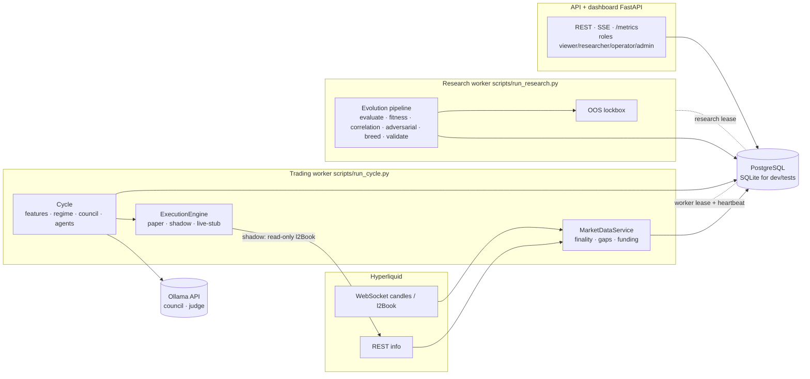
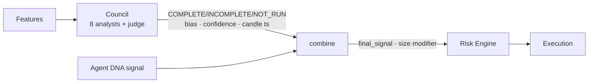
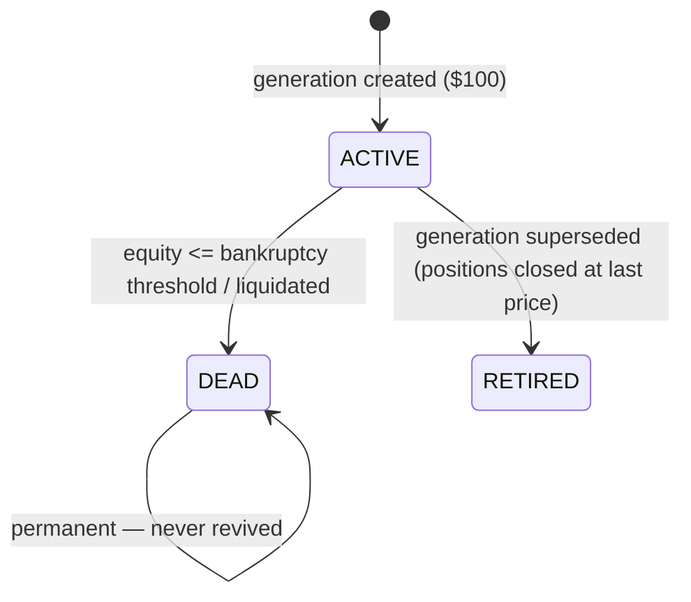

# Architecture

An autonomous **research laboratory** for crypto-perpetual strategies: 500 independent
paper-trading agents, each with its own $100 account and its own strategy DNA, evolving
under scientific validation. **It does not trade real money.** `TRADING_MODE=paper` is the
default, `shadow` measures real-book execution without sending orders, and live order
execution is intentionally not implemented (see [security.md](security.md)).

## 1. System overview



Three processes share one database and never call each other:

| Process | Owns | Single-instance guard |
|---|---|---|
| `scripts.run_cycle` | market ingestion, council, the per-candle agent loop, execution, PnL | durable `worker_leases` row (atomic acquire, fencing epoch, heartbeat, release on shutdown) |
| `scripts.run_research` | scheduled evolution, backtests, OOS lockbox, champion/challenger | its own lease (`research-worker`) |
| `uvicorn app.main:app` | dashboard, REST, SSE, metrics | stateless |

## 2. The trading cycle (one confirmed candle)

```mermaid
sequenceDiagram
  participant S as Scheduler
  participant M as MarketDataService
  participant C as Cycle
  participant O as Ollama council
  participant L as Decision loop (500 agents)
  participant X as ExecutionEngine
  S->>M: wake at bar-close + grace (not "sleep 60")
  M->>M: sync candles · detect gaps · backfill · funding history
  alt unrecovered gap / stale / kill switch
    M-->>L: trading halted -> NO NEW ENTRIES (exits continue)
  end
  S->>C: pending confirmed bars (oldest first)
  C->>C: features + regime (confirmed bars only)
  opt council cadence (every Nth candle)
    C->>O: 8 analysts concurrently, per-analyst + whole-council deadline
    O-->>C: COMPLETE (>=6 valid) / INCOMPLETE (no new trades)
  end
  C->>L: shared context + population-wide indicators (each computed once)
  loop every active agent (SAVEPOINT-isolated)
    L->>L: funding · stop/TP/trailing/liquidation on the bar
    L->>L: DNA signal -> council combine -> Risk Engine -> sizing/margin
    L->>X: order (entry or reduce-only exit)
    X-->>L: fill (fees, slippage, latency, partial)
    L->>L: position · trade · equity · death check
  end
  C->>C: WorkerCycle COMPLETED (idempotent; crash => retried, never lost)
```

**Closed-candle integrity.** A bar is `is_final` only when `close_time + grace <= now` (or the
exchange has started the next bar over the WebSocket). Trading, features, research and backtests
read confirmed bars only; the forming bar is exposed for display as `live_price`. A confirmed bar
is never reverted; if its OHLCV is later revised that is logged as `final_candle_revised`.

**Idempotency at every layer.** `worker_cycles.cycle_id` (a candle is completed once), unique
`(agent_id, market_candle_open_time)` on decisions, deterministic `client_order_id`, unique
`(position_id, funding_time_ms)` on funding payments, a partial unique index allowing at most
**one open position per agent**, and an atomic worker lease.

**Data gaps.** Missing bars are detected over the trailing window, backfilled over REST,
continuity re-validated, and only then is trading resumed. If recovery fails the durable
`data_gap_halt` flag blocks *new* entries through the Risk Engine (exits keep running).

## 3. Strategy DNA is real behaviour

Every DNA field changes runtime behaviour (or is documented metadata):

| DNA field | Effect |
|---|---|
| `indicators` (+periods) | computed dynamically: `ema{period:20}` -> `ema_20`, `rsi{period:7}` -> `rsi_7`. Each distinct spec is computed **once per candle for the whole population** |
| `entry_rules` / `exit_rules` (+`short_*`) | rules reference declared indicator keys; unknown keys are reported, never silently true |
| `strategy_family` | resolves direction (`direction_mode=auto`) and setup strength with genuinely different logic per family (trend / momentum / breakout / mean-reversion / volatility / structure / VWAP / scalping / order-flow / hybrid) |
| `direction_mode` | `auto` (family), `long_only`, `short_only`, `both` (separate long/short entry and exit rules; an opposing entry reverses a position) |
| `regime_preferences` | gate **entries** only; exits are always evaluated |
| `position_sizing` | `fraction_of_equity`, `fixed_notional`, `risk_based`, `volatility_based` (legacy aliases accepted) |
| `stop_loss` / `take_profit` / `trailing_stop` (+`activation_pct`) | applied by the live loop **and** the backtester with the same code |
| `cooldown`, `max_trades_per_day` | hard runtime gates, persisted per agent, counted in bars / candle-UTC days |
| `leverage_limit`, `risk_profile` | leverage multiplies exposure; `max_position_fraction` bounds **margin** |

Sizing records on every order: `requested_notional`, `approved_notional`, `initial_margin`,
`leverage`, `quantity`, `risk_amount`. Risk Engine limits, in order: kill switch / data-gap halt,
council incomplete, stale data, drawdown, daily loss, abnormal volatility, then reductions for
leverage, margin fraction, **gross exposure (2x equity)**, **loss-at-stop (5% of equity)**, DNA cap
and **available margin**.

## 4. Execution, margin, funding

* **Fill timing** (`PAPER_FILL_TIMING`, default `next_open`): a signal on the **close** of bar N becomes a
  persisted `PENDING` order (entry) or a pending exit on the position, filled at the **open of bar N+1**
  and managed on that same bar - exactly the backtest's model, so paper carries no signal-bar look-ahead.
  A pending order not filled on bar N+1 (halt, gap, restart) is `CANCELLED`, never filled late. Sizing and the
  risk check are priced at the signal close (the only price known then); the quantity is converted at the fill
  price. SHADOW keeps immediate fills against the live book (that is what it measures).
* **Paper adapter**: adverse slippage = base bps + size-aware impact (stops and liquidations slip
  more; take-profit limits pay none and the maker fee), reported latency **and latency price drift**,
  lot-size rounding, the real **$10 minimum notional**, random rejects (entries only) and partial fills, all
  deterministic per order id. Realism defaults are ON in production; unit tests pin the stochastic ones off.
* **One accounting implementation** (`execution/accounting.py`): funding, close settlement, liquidation
  penalty, protective levels and cooldown are shared by paper, shadow, backtest, walk-forward and rollover.
  A close that would take an account below zero floors the balance at 0 and records the shortfall as
  `bad_debt` (agent + trade) - never a silent `max(0, ...)`. For a flat account
  `balance = starting + realized_pnl + bad_debt` (asserted in tests, including a gap through liquidation).
* **Margin** (cross, one position per agent): `equity = balance + uPnL`, used/maintenance/available
  margin, liquidation price `P = (qE − balance)/(q(1−mmr))` (long). Liquidation is a real
  reduce-only order plus a penalty fee and is fatal by default.
* **OHLC ambiguity (conservative, tested)**: adverse levels are assumed reached before favourable
  ones (a bar touching stop *and* take-profit takes the stop); the level reached first going
  against the position wins; a gap through a level fills at the **open**; take-profit limits get no
  gap price-improvement; trailing counts the current bar's own extreme by default
  (`TRAILING_STOP_USES_SAME_BAR_EXTREME`: rally first, then fall - the worst case) and arms after `activation_pct`.
* **Funding**: hourly settlements from `fundingHistory` are stored in `funding_rates` and accrued to
  open positions as `funding_payments` (rate, notional, payment, timestamp). Nothing is hard-coded to 0.
* **PnL**: `net = gross − fees − funding` (slippage is already in the fill prices; it is reported,
  not subtracted twice). Trade PnL and agent equity reconcile exactly (tested).

## 5. AI council as *context*, not oracle



`combine(agent_signal, council)`: aligned -> size up (capped), opposed with confidence >= 0.60 -> veto,
opposed lower -> size down, council NEUTRAL -> ×0.75, INCOMPLETE -> no new trades, NOT_RUN -> unchanged.
The council result is bound to its candle and is **never** applied to another one. It cannot bypass
the Risk Engine. Every `Decision` stores `agent_signal`, `council_bias`, `council_confidence`,
`final_signal` and the audit payload. Ollama is called only for the council, the judge and research —
never per agent, never for indicators, PnL, risk, sizing, execution or fitness.

**Quorum**: `COUNCIL_MIN_SUCCESSFUL_ANALYSTS=6` of 8; fewer -> `INCOMPLETE`, `trade_allowed=false`.
**Latency**: analysts run concurrently with a per-analyst timeout and a whole-council deadline;
slow calls are cancelled. With no healthy credential the council fails closed *immediately*.

## 6. Ollama client

Centralised, authenticated, timeout, exponential backoff + jitter, bounded concurrency, request ids
(`X-Request-ID`), pydantic-validated JSON, error classes (auth / rate-limit / timeout / 5xx /
malformed / unavailable). **401/403 mark a key UNHEALTHY until an explicit `refresh_keys()`** — a
known-invalid key is never retried and the next calls fail fast without touching the network.
429 uses `Retry-After` (or an escalating cooldown) on that key only. Keys are reported by index,
never logged.

## 7. Research pipeline (evolution is scheduled, validated and reproducible)

```mermaid
flowchart TD
  G{{Gates: enabled · interval · generation age · paper history · market data}} -->|skip recorded| X[Experiment SKIPPED]
  G --> EP[Freeze epoch: fingerprint + 60/20/20 split]
  EP --> EV[Evaluate train+validation only<br/>BACKTEST · WALK_FORWARD · regime]
  EV --> CO[Correlation<br/>DNA · features · direction · returns · overlap]
  CO --> FI[Fitness v1: paper + validation OOS + WFO + regime + correlation]
  FI --> AD[Adversarial top-K<br/>12 scenarios x cost grid x DNA jitter]
  AD --> FI2[Fitness v2]
  FI2 --> NOM[Nominate top-K]
  NOM --> OOS[[Final OOS lockbox<br/>once per version+dataset]]
  OOS --> CC[Champion/Challenger<br/>lineage-scoped, evidence-gated]
  FI2 --> SEL[Select (dead/rejected/retired never parents) -> crossover/mutation -> seeded RNG]
  SEL --> VAL{Candidate gate: schema + behaviour lint,<br/>then train-slice backtest via Risk Engine}
  VAL -->|fail| REJ[REJECTED event, never inserted]
  VAL --> NEW[ONE transaction: children + elites + snapshots + retire old + new generation]
  CC -.->|champions and observed challengers<br/>carried as elites (same version)| NEW
```

* **Experiment registry**: `experiment_id`, dataset fingerprint, train / validation / OOS periods,
  strategy version, parameters, code version (git or `CODE_VERSION`), schema version (alembic head),
  **engine version and a hash of every result-shaping parameter**, random seed (derived from
  `(research_seed, epoch, generation)` and persisted), timestamps.
* **OOS protection (frozen holdout)**: the OOS range is **sealed once** in a `ResearchEpoch` (`oos_start_ms`,
  `oos_end_ms`, `oos_fingerprint`) and never moves as candles arrive; train/validation are strictly before it.
  The epoch frame is loaded by fixed bounds and its OOS slice is re-verified against the fingerprint on every
  load (a revised/missing bar => the cycle is skipped, never evaluated). Only an explicit operator command
  (`scripts.run_research --new-oos-epoch --reason ...`) replaces it. Sealed columns and every `oos_evaluations`
  row are immutable (ORM guard **and DB triggers**). `evaluate_oos_once` is the only reader: once per version
  (unique constraint) and at most `RESEARCH_OOS_MAX_EVALUATIONS_PER_LINEAGE` per strategy lineage per epoch
  (adaptive-tuning guard). Each result stores lineage, code version, seed and train/validation/OOS periods. The
  score gates promotion only (missing OOS blocks it; the validation score is never a substitute) and paper
  trades overlapping the OOS window are excluded from fitness.
* **Fitness** is a bounded composite (return, profit factor / win rate, expectancy, consistency, WFO,
  validation OOS, regime robustness, adversarial robustness, survival, drawdown/instability/correlation
  penalties). Every component is clipped and every weight is an env var, so no metric can dominate;
  missing evidence contributes 0 rather than a guess.
* **Correlation** is soft diversity pressure (fitness penalty, family caps, preserved minority families) — it
  never kills an agent.
* **Promotion** needs: trade count, OOS, walk-forward, drawdown, profit factor, adversarial robustness,
  regime evidence (specialists welcome; FRAGILE/UNSTABLE need a higher OOS bar), correlation, reality-gap
  degradation, paper track record, real time-in-stage, and a fitness margin over the lineage champion.
  Missing evidence blocks promotion.
* **Snapshots** (`agent_snapshots`) freeze DNA, risk/indicator/regime/model config, fitness, metrics,
  experiment id, code + schema version, dataset fingerprint. ORM guards **and database triggers**
  refuse UPDATE/DELETE. `StrategyVersion.dna` is immutable the same way.

* **Champion / challenger drives the population**: champions and challengers under observation are carried
  into the next generation *unchanged* (same `StrategyVersion`, fresh capital, up to `CHAMPION_ELITE_SLOTS`) so
  their track record can accumulate to a promotion decision (a bred child lives one generation, which otherwise
  made promotion unreachable). `REJECTED`/`RETIRED` versions are never carried and never parents.
  `CHAMPION_MIN_STAGE_DAYS` / `CHAMPION_MIN_OBSERVATION_DAYS` are the real gates; promotion records `promoted_at`.
* **Reality gap**: every stage row carries its observation window; live stages are computed from that stage's
  own trades. Stages are compared per day / per trade and flagged `comparable` only with enough observed time
  (`REALITY_GAP_MIN_OBSERVATION_DAYS`) and trades on both sides - otherwise promotion treats it as missing
  evidence.
* **Reproducibility**: no `random.Random()` without a seed anywhere in the research path; strategy codes are
  seed-derived; adversarial reports persist seed, scenario config, dataset fingerprint and code version.

## 8. Agent lifecycle



Every death stores reason, timestamp, final equity/PnL (re-frozen *after* the forced exit's fee, slippage and
liquidation penalty), generation and strategy version. A new generation gets fresh $100 accounts; old agents are
never silently reset. A flat agent whose equity fell below `AGENT_MIN_VIABLE_EQUITY` (it can never open another
order) is retired as `DEAD` (`untradeable_equity`); an agent with invalid DNA is parked `PAUSED`.

**Positions are always protected.** After the per-agent loop a protection sweep runs funding, stop, take-profit,
trailing and liquidation for *every* open position not yet managed on the bar - a failed agent, invalid DNA, a DEAD
owner (orphan, closed deterministically), another generation. The worker also calls it for bars it could not
decide on: failed attempts, quarantined poison candles and skipped catch-up bars (replayed in order). Management is
idempotent per bar (`positions.last_processed_open_time`); an exit that keeps failing is force-settled at the modelled
price after `EXIT_FORCE_SETTLE_AFTER_ATTEMPTS`. Positions carry the venue that opened them: switching
`TRADING_MODE` with positions open on another venue blocks new entries until they close.

## 9. Shadow mode

`TRADING_MODE=shadow` runs the identical decision pipeline against the **real L2 book**: fills
walk actual depth (partials when depth is insufficient), slippage is measured against the signal
price, and a second snapshot after the assumed latency records the observed drift ("expected vs
actual"). Hypothetical positions/PnL use those fills and are tagged `SHADOW`, so the reality-gap
engine can compare BACKTEST -> PAPER -> SHADOW. The adapter has no signing, no wallet access and can
only call the public read endpoint; tests assert no request other than an `info` read is made.

## 10. Observability

* `/api/system/status` — worker heartbeat & last cycle (latency), database, market-data freshness &
  gap-halt, Hyperliquid stream, Ollama key health, council. The dashboard shows a red banner if the
  worker is down or data is stale; it receives updates over SSE (`/api/stream`) with polling fallback.
* `/metrics` (operator) — Prometheus text (`# TYPE` lines, escaped labels, bounded label cardinality): cycle,
  market-data (REST, backfill) and Ollama latency, Ollama outcomes, council quorum **and per-analyst** failures,
  orders/fills/rejections, fill latency & slippage, risk vetoes **by reason**, DB errors, lease loss, WebSocket
  reconnects/future/stale frames, dead agents, population equity, per-component `component_up`. Every series is
  asserted to be emitted by its code path (`tests/test_metrics_emission.py`). Kill-switch changes are written to an
  append-only `system_events` audit trail.

## 11. Failure handling

| Failure | Behaviour |
|---|---|
| Ollama 401/403 | key UNHEALTHY, council fails closed immediately, no wasted retries |
| Ollama 429 / 5xx / timeout | bounded backoff, `Retry-After`, deadline; council INCOMPLETE => no new trades |
| WebSocket drop / stale | reconnect with backoff; REST keeps data fresh |
| Missing candles | backfill + validate; unrecovered => new entries halted |
| Worker crash mid-cycle | candle stays pending; idempotent re-run (max 3 attempts, then quarantined) |
| Cycle overrun | missed bars replayed in order with entries disabled (bounded) |
| Second worker | refuses to trade (lease) |
| Worker loses / cannot renew its lease | stops at the next agent (local TTL self-fence needs no DB); the cycle's single commit re-verifies owner + epoch + expiry inside the transaction (`FOR SHARE` on PostgreSQL) so a fenced worker persists nothing |
| Council required but failed / late / mis-bound | `INCOMPLETE`: no new entries; exits still run (a judge failure on a weak vote is fail-closed too) |
| Ollama returns non-JSON / malformed / resets the connection | typed `OllamaError`, counted as one abstaining analyst; never crashes the cycle |
| Future / stale / duplicate WS frame | dropped without moving ordering state; REST reconciles |
| Confirmed candle revised or a large gap after an outage | confirmed bars are immutable; backfill is paged and chunked under the driver's bind limit; unrecovered => entries halted, positions still protected |
| One agent raises | SAVEPOINT rolls back that agent only |
| Database down | `/api/system/health` -> 503; worker retries; no partial cycle commits |
| Kill switch | no new entries anywhere; exits/risk management continue |
